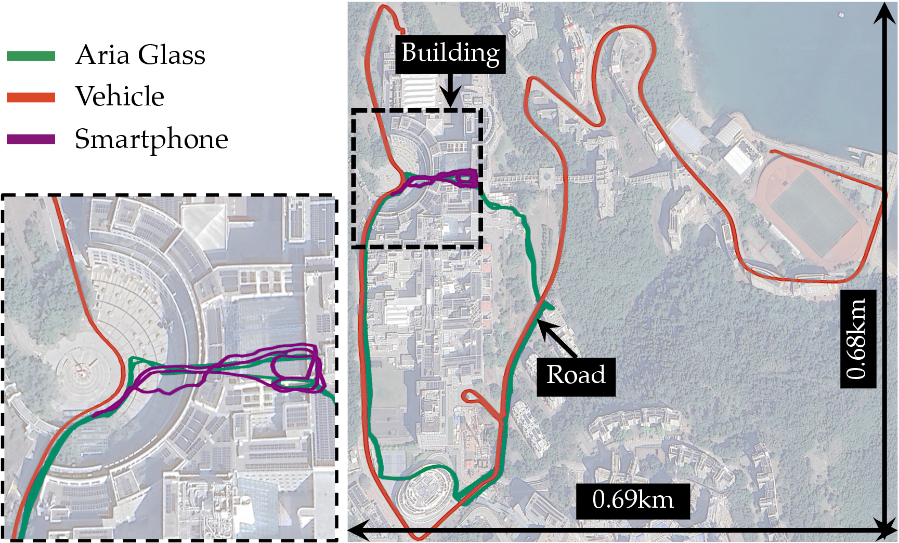
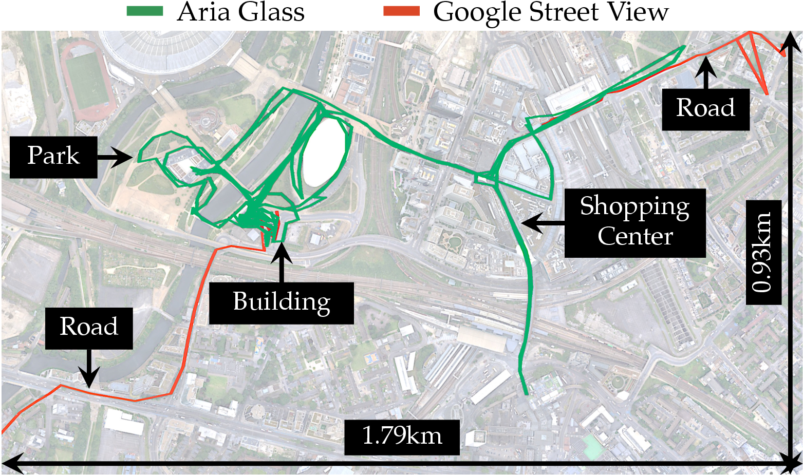

<div align="center">

# OpenNavMap

**Structure-Free Topometric Mapping via Large-Scale Collaborative Localization**

[](https://opensource.org/licenses/MIT)
[](https://rpl-cs-ucl.github.io/OpenNavMap_page/)
[](https://arxiv.org/abs/2601.12291)

</div>

<div align="center" style="width:100%;">
  
</div>

---

## Open-Sourced
The code will be publicly released if the paper is accepted. If you are interested in some implementation details, please feel free to contact me.

## 🚀 Overview

OpenNavMap is a lightweight, structure-free topometric mapping system that enables large-scale collaborative localization across multiple sessions without requiring pre-built 3D models. It leverages 3D geometric foundation models for on-demand reconstruction and provides robust metric localization performance.

---

## ✨ Key Features

- 🎯 **Structure-free Map**: Lightweight graph-based map representation
- 🔗 **Collaborative Localization**: Global registration across sessions in large-scale environments
- 📱 **Cross-Device**: Works on various mobile platforms
- 🔄 **Scalable & Lifelong**: Automatic map maintenance
- 🗺️ **Multi-Session**: Merge maps from different agents/times

---

## 🛠️ Quick Start

<!-- ### Installation -->

Code is coming soon!

<!-- ```bash
# Clone repository
git clone https://github.com/RPL-CS-UCL/OpenNavMap.git
cd OpenNavMap

# Install dependencies
pip install -r requirements.txt
``` -->

<!-- ### Basic Usage

```bash
# Run mapping on a single session
python scripts/run_mapping.py --data_path /path/to/data --output_path /path/to/output

# Collaborative localization (merge multiple submaps)
python scripts/collaborative_localization.py \
    --submap1 /path/to/submap1 \
    --submap2 /path/to/submap2 \
    --output /path/to/merged_map

# Visual navigation
python scripts/run_vnav.py \
    --map_path /path/to/map \
    --goal_image /path/to/goal_image.jpg
``` -->

---

## 🎬 Results Gallery

### Dataset
<p align="center">
  
</p>

<p align="center"><em>
Overview of our self-collected dataset using multiple devices, spanning diverse environments over 3.5 months, 35 sequences, and 18.7km.
</em></p>

### Multi-Session Mapping

<p align="center">
  
  
</p>
<p align="center"><em>
Multi-session mapping with heterogeneous devices across two regions.
</em></p>


### Real-World Image-Goal Navigation

<p align="center">
  
</p>
<p align="center"><em>
Quadruped robot performing image-goal navigation.
</em></p>

<p align="center">
  
</p>
<p align="center"><em>
Autonomous navigation across varied outdoor environments with obstacles.
</em></p>

---

## 📚 Acknowledgement

If this work is helpful to your research, please consider citing OpenNavMap or our related works:

```bibtex
@article{jiao2025opennavmap,
  title={OpenNavMap: Structure-Free Topometric Mapping via Large-Scale Collaborative Localization},
  author={Jiao, Jianhao and Liu, Changkun and Yu, Jingwen and Liu, Boyi and Zhang, Qianyi and Wang, Yue and Kanoulas, Dimitrios},
  journal={Under Review},
  year={2025}
}
```

```bibtex
@inproceedings{jiao2025litevloc,
  title={LiteVLoc: Map-lite visual localization for image goal navigation},
  author={Jiao, Jianhao and He, Jinhao and Liu, Changkun and Aegidius, Sebastian and Hu, Xiangcheng and Braud, Tristan and Kanoulas, Dimitrios},
  booktitle={2025 IEEE International Conference on Robotics and Automation (ICRA)},
  pages={5244--5251},
  year={2025},
  organization={IEEE}
}
```

```bibtex
@article{wei2025fusionportablev2,
  title={Fusionportablev2: A unified multi-sensor dataset for generalized slam across diverse platforms and scalable environments},
  author={Wei, Hexiang and Jiao, Jianhao and Hu, Xiangcheng and Yu, Jingwen and Xie, Xupeng and Wu, Jin and Zhu, Yilong and Liu, Yuxuan and Wang, Lujia and Liu, Ming},
  journal={The International Journal of Robotics Research},
  volume={44},
  number={7},
  pages={1093--1116},
  year={2025},
  publisher={SAGE Publications Sage UK: London, England}
}
```

---

## 📄 License

This project is licensed under the MIT License - see the [LICENSE](LICENSE) file for details.

---

## 🤝 Contact & Links

- **Project Page**: [https://rpl-cs-ucl.github.io/OpenNavMap_page](https://rpl-cs-ucl.github.io/OpenNavMap_page)
- **Contact**: Jianhao Jiao (jiaojh1994@gmail.com), Prof.Dimitrios Kanoulas (d.kanoulas@ucl.ac.uk)
- **Acknowledgments**: Supported by UKRI Future Leaders Fellowship [MR/V025333/1] (RoboHike)

---

<div align="center">
  <sub>Built with ❤️ by the Robot Perception and Learning Lab at UCL</sub>
</div>
