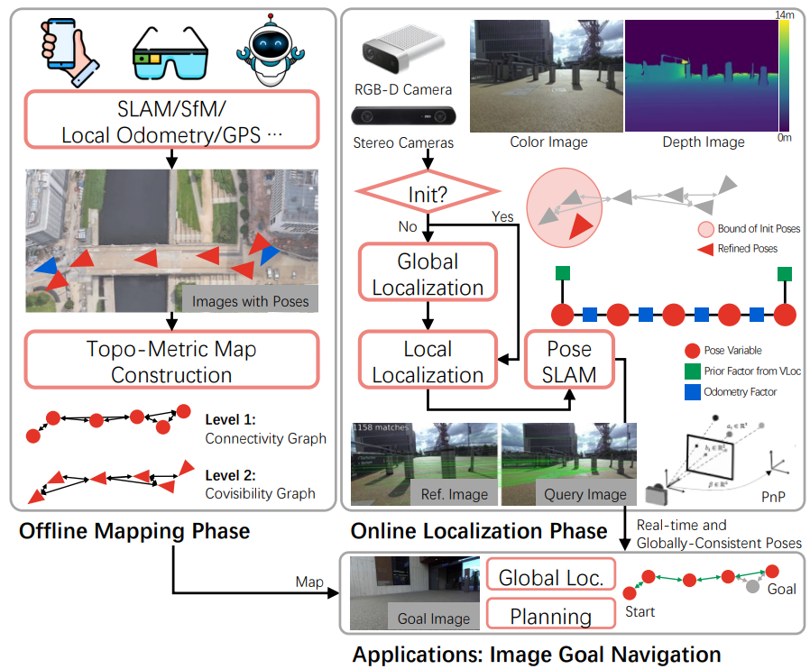
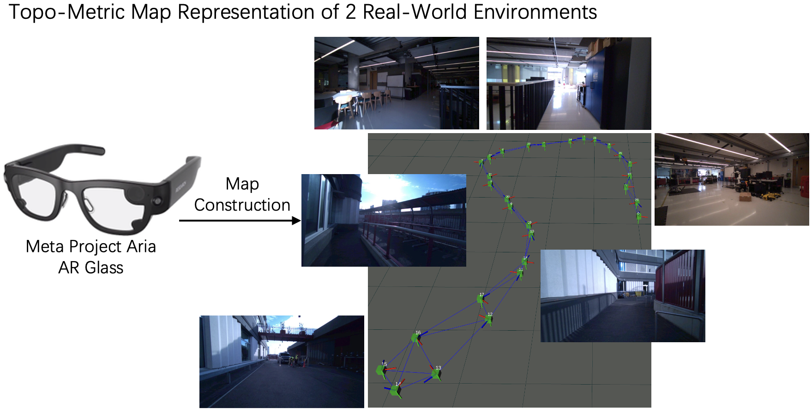
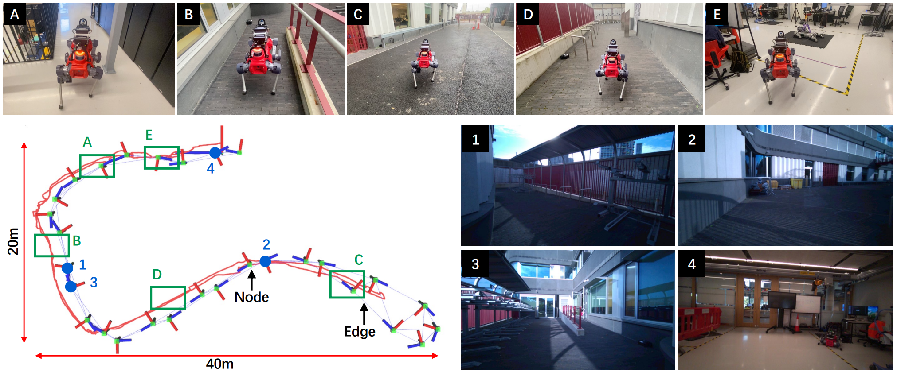

# OpenNavMap

OpenNavMap is the main system for multi-session topometric map construction, submap merging, and scalable image-goal navigation experiments.

LiteVLoc (https://github.com/RPL-CS-UCL/litevloc_code) is the visual localization submodule, included under `third_party/litevloc_code` as a pinned git submodule.

## Overview

OpenNavMap builds, aligns, merges, and maintains multi-session topometric maps for large-scale navigation. The repository contains the OpenNavMap mapping pipeline, map-level benchmarks, and paper experiment code. LiteVLoc remains an independently runnable ROS/Python localization package in `third_party/litevloc_code`.

LiteVLoc was accepted by ICRA2025 as a hierarchical visual localization framework for efficient camera pose estimation using lightweight topometric maps.

<div align="center">
    <a href="">
      
    </a>
</div>
<br>

We use the AR glass to create a lightweight topometric map for camera pose estimation and path planning. We can show an image to the robot, and the robot can autonomously navigate to the goal. Please check our [paper](https://arxiv.org/abs/2410.04419) for the technical explanation and [website](https://rpl-cs-ucl.github.io/LiteVLoc/) for more demonstrations.
<div align="center">
    <a href="">
      
    </a>
</div>

<div align="center">
    <a href="">
      
    </a>
</div>


### Requirements
Create the workspace
```bash
mkdir -p catkin_ws/src/
cd catkin_ws/src/
```
Create conda environment
```bash
conda create --name opennavmap python=3.8
conda activate opennavmap
```
Install ```image-matching-methods```
```bash
git clone git@github.com:gogojjh/image-matching-models.git --recursive
cd image-matching-models && python -m pip install -e .
```
Install  ```VPR-evaluation-methods```
```bash
git clone git@github.com:gogojjh/VPR-methods-evaluation.git
```
Clone with submodules and create conda environment (NVIDIA GeForce RTX 4090 and CUDA 11.8)
```bash
git clone --recurse-submodules git@github.com:RPL-CS-UCL/OpenNavMap.git
conda install pytorch=2.0.1 torchvision=0.15.2 pytorch-cuda=11.8 numpy=1.24.3 -c pytorch -c nvidia # use the correct version of cuda for your system
pip install -r requirements.txt
```
Enter this code to check whether torch-related packages are installed
```bash
python test_torch_install.py
```
Build LiteVloc as the ROS package (optional)
```bash
catkin build litevloc -DPYTHON_EXECUTABLE=$(which python)
```

### Documentation
1. [Instruction in Running Map Merging](docs/instruction_map_merging.md)
2. [Instruction in Processing Dataset](docs/instruction_dataset.md)
3. [Instruction in Running LiteVLoc with Offline Data](docs/instruction_vloc_data.md)
4. [Instruction in Running LiteVLoc with Simulated Matterport3d Environment](docs/instruction_vnav_simu_matterport3d.md)
5. [Instruction in Performing Map-free Benchmarking](docs/instruction_map_free_benchmark.md)

### Multi-Session Mapping Benchmark

We provide a pure Python benchmark under `python/benchmark_mms/` to demonstrate the navigation benefit of multi-session mapping compared with single-session mapping.

The benchmark uses a real OpenStreetMap occupancy grid and simulates 10 crowdsourced mapping sessions. It evaluates spatial coverage growth, goal reachability improvement, path optimality improvement, and long-term map update behavior under dynamic obstacles.

Run:

```bash
conda activate opennavmap
python python/benchmark_mms/multisession_sim_osm.py
```

Generated outputs are saved to:

```bash
python/benchmark_mms/output/
```

The detailed experimental specification is documented in:

```bash
python/benchmark_mms/REQUIREMENTS.md
```

The plotting code uses the project font helper `python/utils/utils_setting_color_font.py`, which enables Matplotlib LaTeX rendering (`usetex=True`). Make sure LaTeX is available:

```bash
which latex
which pdflatex
which dvipng
```

If missing:

```bash
apt-install update
apt-install install -y texlive-latex-base texlive-latex-recommended texlive-fonts-recommended dvipng cm-super
```


### Issues
Issue: ```cannot import name 'cache' from 'functools'```
> Replace the original code with [Link](https://stackoverflow.com/questions/66846743/importerror-cannot-import-name-cache-from-functools)
```bash
from functools import lru_cache
@lru_cache(maxsize=None)
    def xxx
```
Issue: ```/lib/aarch64-linux-gnu/libp11-kit.so.0: undefined symbol: ffi_type_pointer, version LIBFFI_BASE_7.0``` using cv_bridge
> Change the ```.so```. Complete tutorial is shown [here](https://blog.csdn.net/qq_38606680/article/details/129118491)
```bash
rm /Rocket_ssd/miniconda3/envs/litevloc/lib/libffi.so.7
ln -s /usr/lib/aarch64-linux-gnu/libffi.so.7 /Rocket_ssd/miniconda3/envs/litevloc/lib/libffi.so.7
```
```bash
rm /Rocket_ssd/miniconda3/envs/litevloc/lib/libtiff.so.5
ln -s /usr/lib/x86_64-linux-gnu/libtiff.so.5 /Rocket_ssd/miniconda3/envs/litevloc/lib/libtiff.so.5
```
Issue: ```ImportError: /lib/aarch64-linux-gnu/libgomp.so.1: cannot allocate memory in static TLS block```
> Set this in the bash file: ```export LD_PRELOAD=/usr/lib/aarch64-linux-gnu/libgomp.so.1```
