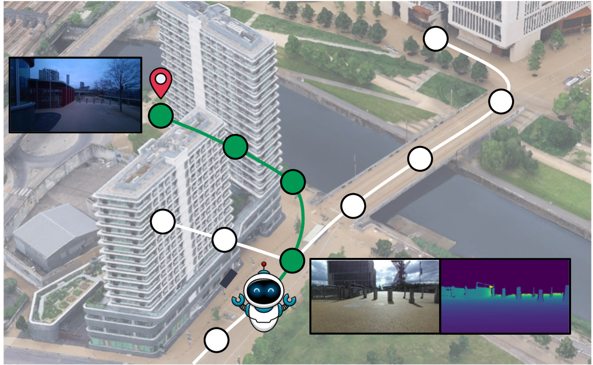
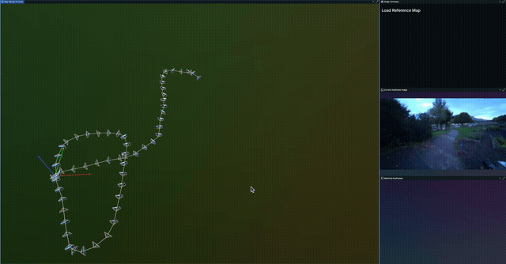
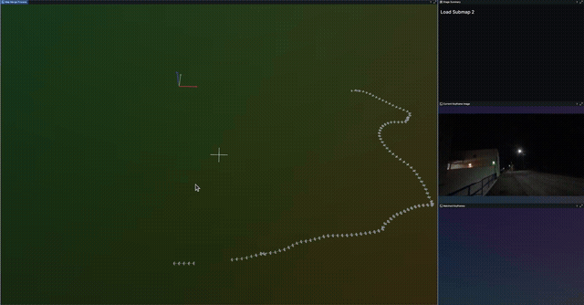
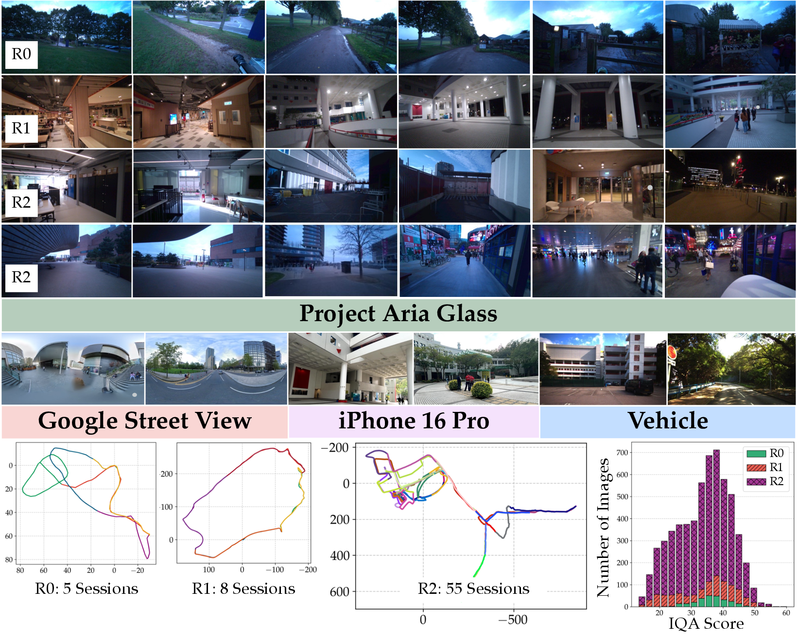
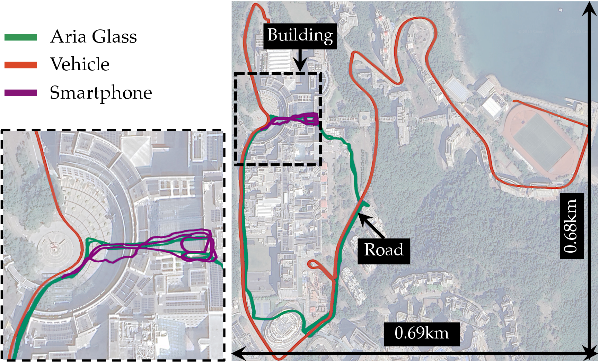
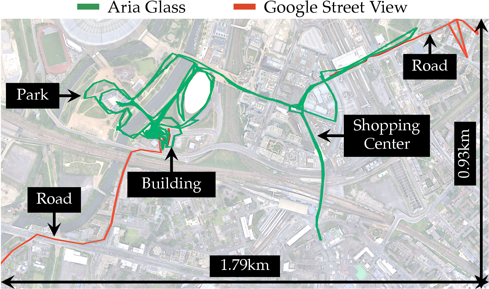
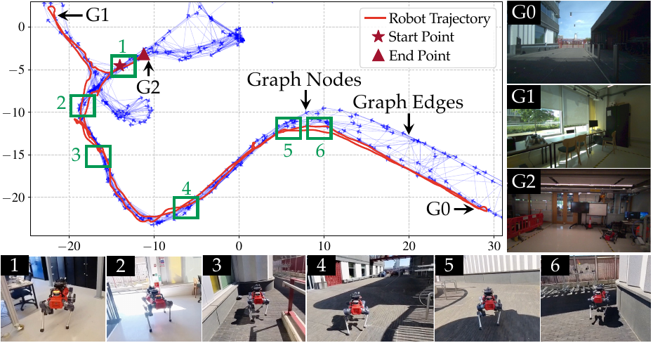
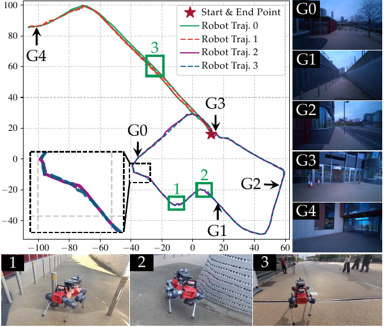

<div align="center">

# OpenNavMap

**OPENNAVMAP: Multi-Session Appearance-Based Topometric Mapping for Scalable Visual Navigation**

[](https://opensource.org/licenses/MIT)
[](https://rpl-cs-ucl.github.io/OpenNavMap_page/)
[](https://arxiv.org/abs/2601.12291)
[](https://github.com/RPL-CS-UCL/OpenNavMap)

</div>

<div align="center">
  
</div>

---

## 🏠 Introduction

OpenNavMap is a lightweight, structure-free topometric mapping system that enables large-scale collaborative localization across multiple sessions without requiring pre-built 3D models. It builds, aligns, merges, and maintains **multi-session topometric maps** for image-goal navigation.

The system represents environments using three complementary graph structures:

- **Covis Graph (`covis`)**: image keyframes with visual associations and descriptors
- **Odometry Graph (`odom`)**: sequential pose chain from odometry
- **Traversability Graph (`trav`)**: connectivity for path planning

The repository consists of three main lines:

1. **Multi-Session Mapping & Merging** — `python/map_merge_pipeline.py`, `python/map_manager.py`
2. **Visual Localization** — LiteVLoc submodule at `third_party/litevloc_code` ([github](https://github.com/RPL-CS-UCL/litevloc_code)), performing global VPR → local matching → pose solving on the built map
3. **Navigation & System Integration** — global planning, pose fusion, and online ROS localization (within the LiteVLoc submodule)

### Highlights

- 🎯 **Structure-free Map**: Lightweight graph-based map representation
- 🔗 **Collaborative Localization**: Global registration across sessions in large-scale environments
- 📱 **Cross-Device**: Works on various mobile platforms
- 🔄 **Scalable & Lifelong**: Automatic map maintenance
- 🗺️ **Multi-Session**: Merge maps from different agents/times

---

## 🔥 News

| Time | Update |
|---------|--------|
| 2026/07 | Full codebase released: multi-session mapping, submap merging, and benchmark. |
| | Third-party libraries also published: |
| | • [litevloc_code](https://github.com/RPL-CS-UCL/litevloc_code) — visual localization (global VPR → local matching → pose solving) |
| | • [pose_estimation_models](https://github.com/gogojjh/pose_estimation_models) — pose estimation |
| | • [VPR-methods-evaluation](https://github.com/gogojjh/VPR-methods-evaluation) — visual place recognition benchmarking |
| | • [slam_trajectory_evaluation](https://github.com/gogojjh/slam_trajectory_evaluation) — trajectory evaluation |
| | • [vismatch](https://github.com/gogojjh/vismatch) — visual matching |
| 2026/01 | Paper submitted (Under Review). |
| 2025/05 | LiteVLoc accepted by ICRA 2025. |

---

## 📋 Table of Contents

- [🏠 Introduction](#-introduction)
- [🔥 News](#-news)
- [🛠️ Getting Started](#-getting-started)
- [📚 Documentation](#-documentation)
- [📊 Multi-Session Mapping Benchmark](#-multi-session-mapping-benchmark)
- [🎬 Results Gallery](#-results-gallery)
- [🐛 Known Issues](#-known-issues)
- [🔗 Citation](#-citation)
- [📄 License](#-license)
- [👏 Acknowledgements](#-acknowledgements)
- [📞 Contact](#-contact)

---

## 🛠️ Getting Started

### Requirements

Create the workspace:
```bash
mkdir -p catkin_ws/src/
cd catkin_ws/src/
```

Create conda environment:
```bash
conda create --name opennavmap python=3.8
conda activate opennavmap
```

Clone with submodules and set up environment (NVIDIA GeForce RTX 4090 and CUDA 11.8):
```bash
git clone --recurse-submodules git@github.com:RPL-CS-UCL/OpenNavMap.git
cd OpenNavMap
conda install pytorch=2.0.1 torchvision=0.15.2 pytorch-cuda=11.8 numpy=1.24.3 -c pytorch -c nvidia
pip install -r requirements.txt
pip install -e third_party/vismatch
```

> **Note:** `third_party/litevloc_code` is a **required** submodule, not optional. It provides the core graph structures (`image_graph.py`, `point_graph.py`, etc.) and shared utility functions used directly by OpenNavMap. If you cloned without `--recurse-submodules`, run `git submodule update --init --recursive` before proceeding. All scripts must set `PYTHONPATH` to include both `python/` and `third_party/litevloc_code/python/`, e.g.:
> ```bash
> export PYTHONPATH=$(pwd)/python:$(pwd)/third_party/litevloc_code/python
> ```

Verify torch installation:
```bash
python test_torch_install.py
```

---

## 📚 Documentation

**OpenNavMap:**
1. [Instruction in Running Map Merging](docs/instruction_map_merging.md)
2. [Instruction in Processing Dataset](docs/instruction_dataset.md)
3. [Instruction in Data Collection (Project Aria)](docs/instruction_data_collection.md)

**LiteVLoc submodule (`third_party/litevloc_code`):**

5. [Instruction in Running LiteVLoc with Offline Data](docs/instruction_vloc_data.md)
6. [Instruction in Running Visual Navigation with Simulated Matterport3d](docs/instruction_vnav_simu_matterport3d.md)
7. [Instruction in Running Visual Navigation with Real Robots](docs/instruction_vnav_real_robot.md)

**Additional:**
8. [Repo Structure Guide](docs/repo_structure_brief.md)

---

## 📊 Multi-Session Mapping Benchmark

We provide a pure Python benchmark under `python/benchmark_mms/` to demonstrate the navigation benefit of multi-session mapping compared with single-session mapping.

The benchmark uses a real OpenStreetMap occupancy grid and simulates 10 crowdsourced mapping sessions. It evaluates spatial coverage growth, goal reachability improvement, path optimality improvement, and long-term map update behavior under dynamic obstacles.

Run:

```bash
conda activate opennavmap
python python/benchmark_mms/multisession_sim_osm.py
```

Generated outputs are saved to:

```bash
python/benchmark_mms/output/
```

The detailed experimental specification is documented in:

```bash
python/benchmark_mms/REQUIREMENTS.md
```

The plotting code uses the project font helper `python/utils/utils_setting_color_font.py`, which enables Matplotlib LaTeX rendering (`usetex=True`). Make sure LaTeX is available:

```bash
which latex
which pdflatex
which dvipng
```

If missing:

```bash
apt update
apt install -y texlive-latex-base texlive-latex-recommended texlive-fonts-recommended dvipng cm-super
```

---

## 🎬 Results Gallery

### Multi-Session Map Merging

<p align="center">
  
</p>
<p align="center"><em>
Vineyard — outdoor multi-session map merging.
</em></p>

<p align="center">
  
</p>
<p align="center"><em>
HKUST Campus — multi-session submaps aligned and merged into a unified topometric map.
</em></p>

<p align="center">
  
</p>
<p align="center"><em>
UCL Campus — multi-session map merging across heterogeneous devices.
</em></p>

### Dataset

<p align="center">
  
</p>

<p align="center"><em>
Overview of our self-collected dataset using multiple devices, spanning diverse environments over 3.5 months, 35 sequences, and 18.7km.
</em></p>

### Multi-Session Mapping

<p align="center">
  
  
</p>
<p align="center"><em>
Multi-session mapping with heterogeneous devices across two regions.
</em></p>

### Real-World Image-Goal Navigation

<p align="center">
  
  
</p>
<p align="center"><em>
Quadruped robot performing image-goal navigation in lab (left) and outdoor environments (right).
</em></p>

---

## 🐛 Known Issues

Issue: `cannot import name 'cache' from 'functools'`
> Replace the original code with [Link](https://stackoverflow.com/questions/66846743/importerror-cannot-import-name-cache-from-functools)
```bash
from functools import lru_cache
@lru_cache(maxsize=None)
    def xxx
```

Issue: `/lib/aarch64-linux-gnu/libp11-kit.so.0: undefined symbol: ffi_type_pointer, version LIBFFI_BASE_7.0` using cv_bridge
> Change the `.so`. Complete tutorial is shown [here](https://blog.csdn.net/qq_38606680/article/details/129118491)
```bash
rm /Rocket_ssd/miniconda3/envs/opennavmap/lib/libffi.so.7
ln -s /usr/lib/aarch64-linux-gnu/libffi.so.7 /Rocket_ssd/miniconda3/envs/opennavmap/lib/libffi.so.7
```
```bash
rm /Rocket_ssd/miniconda3/envs/opennavmap/lib/libtiff.so.5
ln -s /usr/lib/x86_64-linux-gnu/libtiff.so.5 /Rocket_ssd/miniconda3/envs/opennavmap/lib/libtiff.so.5
```

Issue: `ImportError: /lib/aarch64-linux-gnu/libgomp.so.1: cannot allocate memory in static TLS block`
> Set this in the bash file: `export LD_PRELOAD=/usr/lib/aarch64-linux-gnu/libgomp.so.1`

---

## 🔗 Citation

If this work is helpful to your research, please consider citing OpenNavMap or our related works:

```bibtex
@article{jiao2025opennavmap,
  title={OpenNavMap: Multi-Session Appearance-Based Topometric Mapping for Scalable Visual Navigation},
  author={Jiao, Jianhao and Liu, Changkun and Yu, Jingwen and Liu, Boyi and Zhang, Qianyi and Wang, Yue and Kanoulas, Dimitrios},
  journal={Under Review},
  year={2025}
}
```

```bibtex
@inproceedings{jiao2025litevloc,
  title={LiteVLoc: Map-lite visual localization for image goal navigation},
  author={Jiao, Jianhao and He, Jinhao and Liu, Changkun and Aegidius, Sebastian and Hu, Xiangcheng and Braud, Tristan and Kanoulas, Dimitrios},
  booktitle={2025 IEEE International Conference on Robotics and Automation (ICRA)},
  pages={5244--5251},
  year={2025},
  organization={IEEE}
}
```

```bibtex
@article{wei2025fusionportablev2,
  title={Fusionportablev2: A unified multi-sensor dataset for generalized slam across diverse platforms and scalable environments},
  author={Wei, Hexiang and Jiao, Jianhao and Hu, Xiangcheng and Yu, Jingwen and Xie, Xupeng and Wu, Jin and Zhu, Yilong and Liu, Yuxuan and Wang, Lujia and Liu, Ming},
  journal={The International Journal of Robotics Research},
  volume={44},
  number={7},
  pages={1093--1116},
  year={2025},
  publisher={SAGE Publications Sage UK: London, England}
}
```

---

## 📄 License

This project is licensed under the MIT License - see the [LICENSE](LICENSE) file for details.

---

## 👏 Acknowledgements

Supported by UKRI Future Leaders Fellowship [MR/V025333/1] (RoboHike), built by the Robot Perception and Learning Lab at UCL.

---

## 📞 Contact

- **Project Page**: [https://rpl-cs-ucl.github.io/OpenNavMap_page](https://rpl-cs-ucl.github.io/OpenNavMap_page)
- **Contact**: Jianhao Jiao (jiaojh1994@gmail.com), Prof. Dimitrios Kanoulas (d.kanoulas@ucl.ac.uk)
