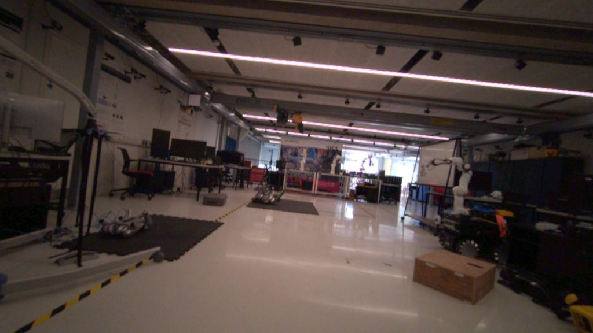
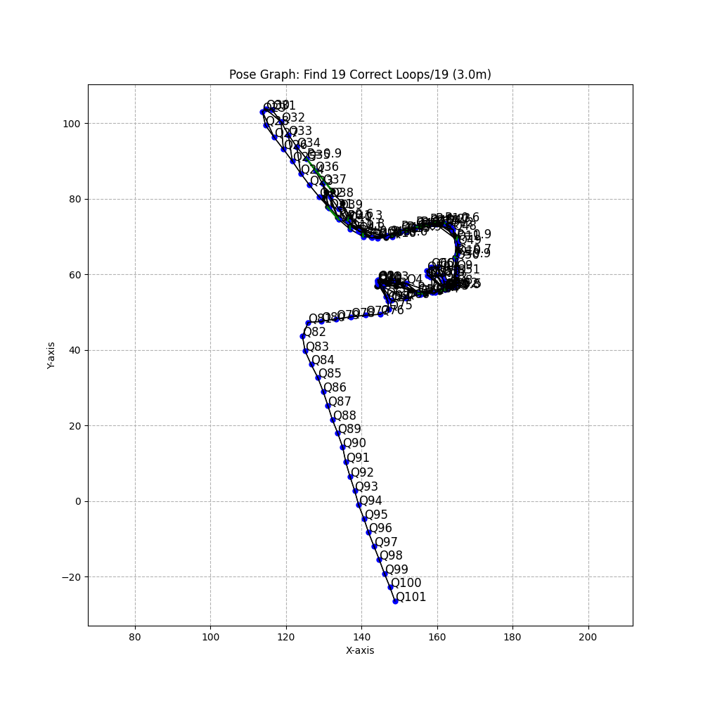
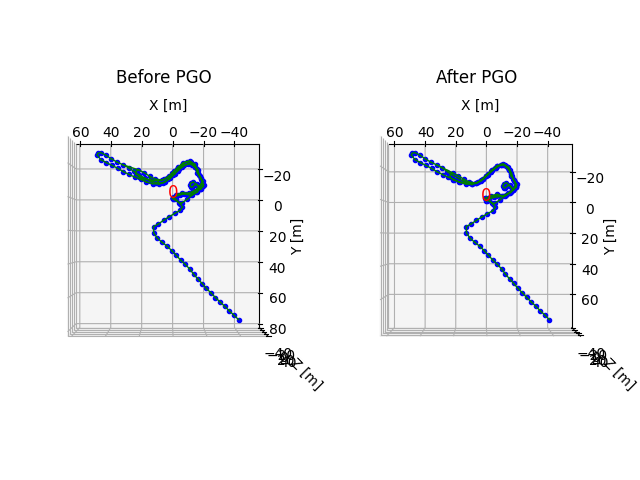

# Multi-Session Map Merging Instructions

`python/map_merge_pipeline.py` merges multiple independently collected submaps into a single, consistent topometric map. The core pipeline consists of cross-submap loop detection (VPR), relative pose estimation, pose graph optimization (GTSAM), and node culling (image quality assessment IQA, information gain, temporal difference).

## 1. Environment Setup

Set `PYTHONPATH` as required by the repository root `CLAUDE.md`:

```bash
conda activate opennavmap
export PYTHONPATH=$(pwd)/python:$(pwd)/third_party/litevloc_code/python
```

## 2. Submap Data Format

Each submap is a self-contained directory with the following structure:

```bash
<scene>_aria_data_<tag>/<submap_id>/   # submap_id is an integer, e.g. 0, 1, 2...
├── seq/000000.color.jpg               # color image frames
│   000001.color.jpg
│   ...
├── intrinsics.txt                     # camera intrinsics: fx fy cx cy width height
├── poses.txt                          # per-frame pose, map-free format: qw qx qy qz tx ty tz
├── poses_abs_gt.txt                   # per-frame GT (absolute) pose, same format as above
├── timestamps.txt                     # per-frame timestamp
├── edges_covis.txt                    # covisibility edges: [node_a, node_b, weight] (0: low, 1: high)
├── edges_odom.txt                     # odometry edges (adjacent/consecutive nodes)
├── edges_trav.txt                     # traversability edges (nodes reachable from each other)
├── database_descriptors.txt           # 256-dim CosPlace VPR global descriptors
├── gps_data.txt                       # GPS data (optional)
└── iqa_data.txt                       # image quality score (optional, 0: poor e.g. low light/motion blur, 100: good)
```

`poses.txt` / `poses_abs_gt.txt` follow the same world-to-camera convention as the map-free benchmark, i.e. $Rp+t$ transforms a point from the world frame to the camera frame; the first frame of each submap is always the identity pose.

Example `seq/*.color.jpg` frame from `ucl_campus_aria/s00000_aria_data_000/0/seq/000099.color.jpg`:



## 3. Dataset Root Layout and the Orders File

```bash
<dataset_root>/
└── <scene>/                                # e.g. ucl_campus_aria, hkust_campus, vineyard
    ├── s00000_aria_data_000/               # submap data directory (--data_dir, default <scene>_aria_data_390)
    │   ├── 0/  1/  2/  ...                 # submaps, ids match the orders file
    ├── s00000_orders.txt                   # merge order table, see below
    └── s00000_results_<order_tag>_<method>/  # merge output (auto-generated, see section 6)
```

Each line of `s00000_orders.txt` is one merge order, submap ids separated by spaces; the line number maps to `--order_index`:

```text
0 1 2 3 4 5 6 7      # order_index=0 -> order_tag "in" (input order)
0 1 5 2 4 7 3 6      # order_index=1 -> order_tag "r0" (random order 1)
6 2 3 0 4 5 7 1      # order_index=2 -> order_tag "r1" (random order 2)
```

`order_tag` lookup (`--order_index` → directory/file name suffix): `0=in, 1=r0, 2=r1, ..., 9=r8`.

## 4. Quick Start: One-Shot Script

The recommended entry point is `scripts/run_map_merging.sh`, which runs three steps in sequence: map merging → pose conversion to TUM format → trajectory evaluation.

```bash
bash scripts/run_map_merging.sh <SCENE> <ORDER> <METHOD> <POSE_EST> [IQA] [IG] [TD] [MAX_SUBMAPS]
```

| Argument | Description |
|---|---|
| `SCENE` | Scene id, e.g. `s00000` |
| `ORDER` | Merge order index, row number in `s00000_orders.txt` (0=in, 1=r0, ...) |
| `METHOD` | Result directory naming tag, e.g. `spgo_cc_seqmatch_master` (naming only, does not affect the algorithm) |
| `POSE_EST` | Relative pose estimation model, e.g. `master` (see the matching models supported by `third_party/vismatch`) |
| `IQA` / `IG` / `TD` | Node culling ablation switches: image quality assessment / information gain / temporal difference, `1`=enabled (default), `0`=disabled |
| `MAX_SUBMAPS` | Maximum number of submaps to merge, default is all |

Examples:

```bash
# Default dataset (ucl_campus_aria), input order, all submaps, all culling factors enabled
bash scripts/run_map_merging.sh s00000 0 spgo_cc_seqmatch_master master

# Merge only the first 3 submaps, disable IQA culling
bash scripts/run_map_merging.sh s00000 0 spgo_cc_seqmatch_master master 0 1 1 3
```

Data paths can be overridden via environment variables (see the script header for defaults):

```bash
DATASET_ROOT=/path/to/hkust_campus \
OUTPUT_ROOT=/path/to/hkust_campus \
TRAJ_EVAL_ROOT=/path/to/traj_eval_data/test_eval_data \
bash scripts/run_map_merging.sh s00000 0 spgo_cc_seqmatch_master master
```

## 5. Calling map_merge_pipeline.py Directly

If you only need the merge step (without trajectory conversion/evaluation), call the pipeline script directly:

```bash
python python/map_merge_pipeline.py \
    --dataset_root <dataset_root> \
    --scene s00000 \
    --order_index 0 \
    --method spgo_cc_seqmatch_master \
    --pose_estimation_method master \
    --image_size 512 288 \
    --vpr_match_model vpr_dp \
    --vpr_match_seq_len 10 \
    --use_iqa --use_ig --use_td \
    --viz
```

Key arguments:

| Argument | Default | Description |
|---|---|---|
| `--dataset_root` | required | Dataset root directory containing scene data and the orders file |
| `--output_root` | same as `dataset_root` | Output root directory for merge results |
| `--scene` | required | Scene name, e.g. `s00000` |
| `--data_dir` | `<scene>_aria_data_390` | Submap data directory name |
| `--order_index` | required | Row number in the orders file (0=in, 1=r0, ...) |
| `--method` | required | Result directory naming tag, does not affect the algorithm |
| `--max_submaps` | all | Limit the number of submaps to merge |
| `--image_size` | none | Image resize shape (W H) |
| `--vpr_match_model` | `vpr_dp` | Cross-submap loop retrieval model: `single_match` / `seqslam` / `vpr_dp` |
| `--vpr_match_seq_len` | `10` | VPR sequence matching length |
| `--pose_estimation_method` | `master` | Relative pose estimation model (see `third_party/vismatch` for supported models) |
| `--device` | `cuda` | `cuda` or `cpu` |
| `--use_iqa` / `--use_ig` / `--use_td` | disabled | Node culling ablation switches: image quality / information gain / temporal difference |
| `--viz` | disabled | Whether to write visualization images |
| `--rerun-viz` | disabled | Whether to record a Rerun visualization (`.rrd`); combine with `--rerun-output` etc. |

## 6. Output Directory Structure

Merge results are written to `<output_root>/<scene>_results_<order_tag>_<method>/`:

```bash
s00000_results_in_spgo_cc_seqmatch_master/
├── merge_0/                      # submap 0 only (initial state)
├── merge_0_1/                    # intermediate map after merging submap 0+1
├── merge_0_1_2/                  # incremental, one new submap merged in per step
├── ...
├── merge_0_1_2_..._N/            # final merged map (all submaps included)
│   ├── poses.txt                 # merged per-frame poses (map-free format)
│   ├── poses_abs_gt.txt          # GT poses (if available, used for evaluation)
│   ├── timestamps.txt
│   ├── intrinsics.txt
│   ├── edges_covis.txt / edges_odom.txt / edges_trav.txt
│   ├── seq/, preds/              # images and visualization outputs (with --viz)
│   └── submap_disc_0/            # discretized final submap used by run_map_merging.sh for TUM conversion
└── merge_finalmap -> merge_0_1_2_..._N/   # symlink to the final merge step, created automatically
```

Each intermediate `merge_*` directory follows the same submap data structure described in section 2, which makes it easy to inspect merge quality step by step. `merge_finalmap` is always a symlink pointing at whichever `merge_0_1_2_..._N` directory contains the result of the last submap merged.

## 7. Visualization Examples

Running with `--viz` writes plots into each `merge_*/preds/` directory. Two of these outputs are especially useful for understanding what the pipeline is doing; example images below were generated from a real 2-submap merge step on the `ucl_campus_aria` scene (`s00000_results_in_kf_spgo_cc_seqmatch/merge_0_1`).

### 7.1 Cross-submap loop detection

`preds/results_sequence_match_adaptive_refine_1_posegraph.png` overlays the detected loop-closure edges (thin diagonal lines) on top of the odometry trajectories (thick black lines) of all submaps merged so far. Each thin line connects a query keyframe to the database keyframe found via VPR sequence matching — this is the raw evidence the pipeline uses to know which submaps overlap in physical space before optimizing anything.



In this example, the title `Pose Graph: Find 19 Correct Loops/19 (3.0m)` means all 19 candidate loop closures passed the distance-based sanity check (within 3.0 m of the estimated relative pose) and were accepted into the pose graph — the two submaps overlap heavily, so nearly every candidate keyframe pair is confirmed as a valid loop closure.

### 7.2 Pose graph optimization (before/after PGO)

`preds/pose_graph_refined.png` shows the same trajectory before and after GTSAM pose graph optimization. Before optimization (left), the disjoint submap trajectories are only loosely aligned by the raw loop-closure constraints (shown as the fan of thin lines). After optimization (right), all submap trajectories have been jointly refined into a single, globally consistent trajectory.



This is the key visual check when debugging a merge: if the "after" plot still shows visible seams or discontinuities where two submaps should overlap, the loop closures in section 7.1 were likely too few, too noisy, or geometrically incorrect.

## 8. Trajectory Evaluation

`run_map_merging.sh` automatically converts `poses.txt` / `poses_abs_gt.txt` of the final merged submap to TUM format and calls `third_party/slam_trajectory_evaluation` for evaluation (not `evo`). To run evaluation on its own:

```bash
bash python/benchmark_map_merge/scripts/run_evaluation.sh --config <config>.yaml
```

## 9. Troubleshooting

- **`cannot import name 'cache' from 'functools'`**: replace `functools.cache` with `functools.lru_cache(maxsize=None)`.
- **Empty merge result / missing final map**: check whether `--order_index` is out of range (exceeding the number of lines in the orders file raises an error), and whether `--data_dir` matches the actual submap directory name.
- **Large-scale baseline comparison (SfM methods, etc.)**: see `python/benchmark_map_merge/scripts/run_baseline.sh`, used to batch build/merge/evaluate HLoc-SfM-based baseline results; naming conventions are documented in the `benchmark_map_merge` section of the repository root `CLAUDE.md`.
